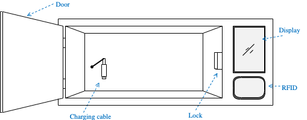
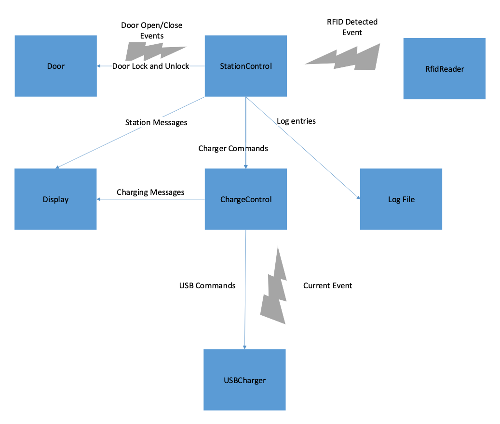
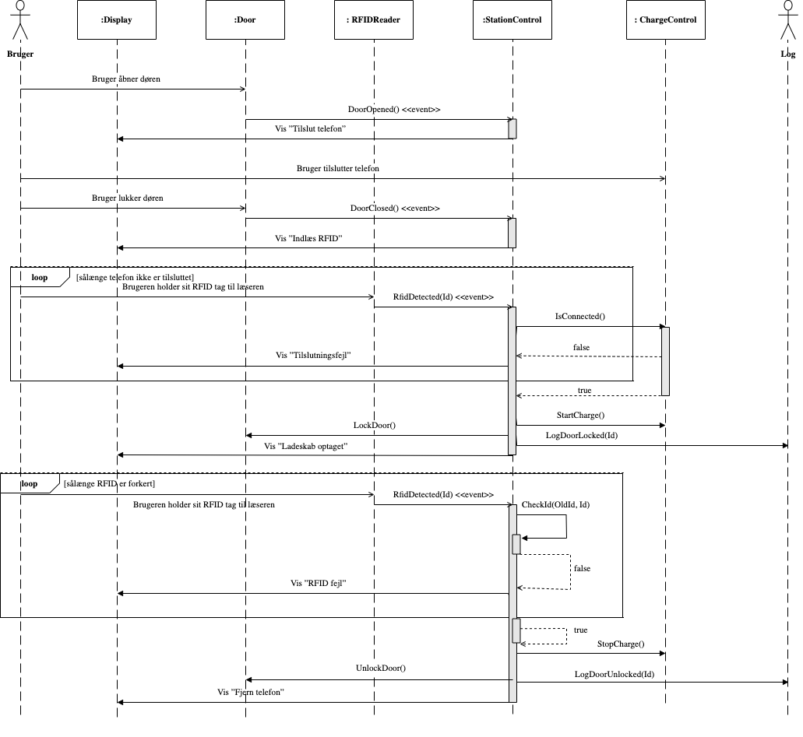
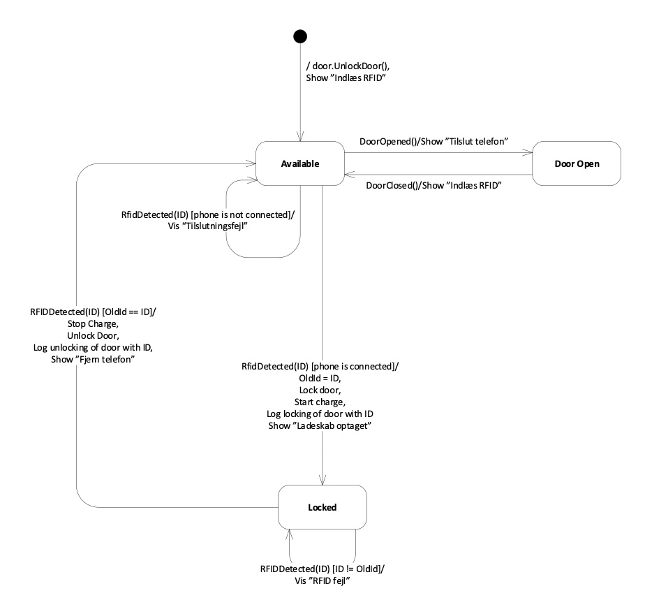
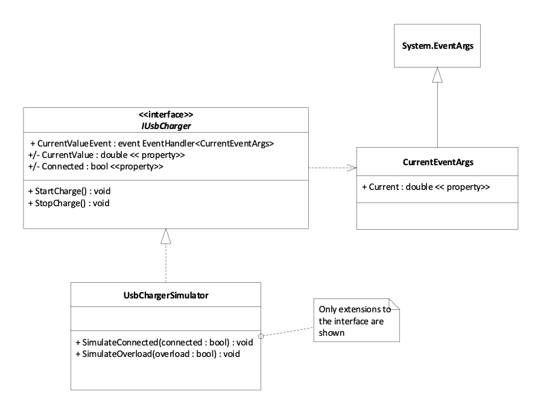

*Aarhus Universitet – Institut for Elektro- og Computerteknologi – SW4SWT* 

# Specifikation af Hand-in 2 

## 1  Introduktion 
Dette dokument beskriver specifikationen for den 2. obligatoriske handin i faget Softwaretest. Den skal udarbejdes i grupper og afleveres og godkendes som beskrevet i FeedbackFruits.

Denne beskrivelse består af 3 dele. 

1. Første del: **Ladeskab til mobiltelefon** er specifikation og information til et ladeskab for mobiltelefoner, som er det system, der skal designes, implementeres og unittestes. 
1. Anden del: **Krav til afleveringen til Handin 2** beskriver kravene til gennemførelse af opgaven, hvordan der skal arbejdes, hvad der skal afleveres og hvad afleveringen skal indeholde. 
1. Tredje del: **Resurser** fortæller om de bilag, der kan give ideer og supplement til udførelse af opgaven og yderligere specifikation af dele af systemet. 

Kravene til afleveringen er afspejlet i de evalueringsspørgsmål, der er oprettet til afleveringen og som kan findes i afsnit 5.
 
## 2  Ladeskab til mobiltelefon 
Denne opgave omhandler design, implementering og test af software til et ladeskab til en mobiltelefon, som skal opstilles i omklædningsrummet i en svømmehal eller lignende. Formålet med ladeskabet er, at en bruger kan tilslutte sin mobiltelefon til opladning i ladeskabet, efterlade sin telefon her og senere afhente den igen. Som identifikation tænkes en RFID tag der hænger på badebåndet eller nøglen til et tøjskab. 

En principskitse af ladeskabet er vist herunder: 



*Figur 1: Principskitse af ladeskabet*

Ladeskabet tænkes brugt som følger (det antages at skabet ikke er i brug): 

1. Brugeren åbner lågen på ladeskabet 
2. Brugeren tilkobler sin mobiltelefon til ladekablet. 
3. Brugeren lukker lågen på ladeskabet. 
4. Brugeren holder sit RFID tag op til systemets RFID-læser. 
5. Systemet aflæser RFID-tagget. Hvis ladekablet er forbundet, låser systemet lågen på ladeskabet, og låsningen logges. Skabet er nu *optaget*. Opladning påbegyndes. 

Brugeren kan nu forlade ladeskabet og komme tilbage senere. Herefter fortsætter den tiltænkte brug som følger: 

6. Brugeren kommer tilbage til ladeskabet. 
6. Brugeren holder sit RFID tag op til systemets RFID-læser. 
6. Systemet aflæser RFID-tagget. Hvis RFID er identisk med det, der blev brugt til at låse skabet med, stoppes opladning, ladeskabets låge låses op og oplåsningen logges. 
6. Brugeren åbner ladeskabet, fjerner ladekablet fra sin telefon og tager telefonen ud af ladeskabet. 
6. Brugeren lukker skabet. Skabet er nu *ledigt*. 

Når låsning/oplåsning finder sted, skal begivenheden logges til en fil inkl. timestamp (timer, minutter og sekunder), det aktuelle RFID samt en beskrivende tekst for begivenheden. 

Et sekvensdiagram for denne del af kravspecifikationen kan ses nedenfor i Figur 3: Sekvensdiagram for anvendelse af ladeskabet.

**OBS! Følgende er også en del af kravspecifikationen. Der er ikke vist sekvensdiagram for disse aktiviteter.** 

Opladningsdelen benytter sig af et USB styring, der kan tænde/slukke spændingen på ladestikket og måle den aktuelle ladestrøm, samt konstatere om der er en telefon forbundet til stikket. 

Opladningsdelen skal holde øje med, om opladningen er færdig, eller om der en fejlsituation. Ud fra målingen af ladestrømmen fra USB chippen kan følgende situationer opremses: 

|**Målt ladestrøm** |**Betydning** |
| - | - |
|0 mA |Der er ingen forbindelse til en telefon, eller ladning er ikke startet. Displayet viser ikke noget om ladning. |
|0 mA < ladestrøm ≤ 5 mA |Opladningen er tilendebragt, og USB ladningen **kan stoppes**. Displayet viser, at telefonen er fuldt opladet. |
|5 mA < ladestrøm  ≤ 500 mA |Opladningen foregår normalt. Displayet viser, at ladning foregår. |
|ladestrøm > 500 mA |Der er noget galt, fx en kortslutning. USB ladningen **skal straks stoppes**. Displayet viser en fejlmeddelelse. |

Displayet har 2 områder, der kan anvendes til henholdsvis brugerinstruktioner og –meddelelser, og til status/meddelelser for opladningsdelen. 

Et løseligt udkast til et design (*ikke* et UML klassediagram) er givet nedenfor: 


*Figur 2: Designskitse* 

Klasserne Door, Display, RFIDReader, USBCharger på Figur 2 repræsenterer komponenter af samme navne på Figur 1. Log File kan ikke ses fysisk udefra, men er indbygget i systemet, og **logging til en fil er en del** af denne opgave. Klassen StationControl er controller-klassen for systemet. ChargeControl er controller-klassen for opladningen. Læg mærke til, at controller-klassen ChargeControl ikke er den samme som boundary-klassen USBCharger. 

Lynsymbolerne indikerer at her tænkes brugt en implementation af Observer Pattern ved hjælp af C# events, hvor den brede ende er Subject og den smalle ende peger på en Observer. Andre implementationer er også **tilladt**, de **skal** selvfølgelig også testes. 

Klassernes interaktion er vist på Figur 3. Selve opladningssekvensen er ikke vist. Find ud af hvilke klasser, der indgår i den, og tegn selv et sekvensdiagram. 


*Figur 3: Sekvensdiagram for anvendelse af ladeskabet* 

Klassen StationControl’s virkemåde kan beskrives vha. et UML tilstandsdiagram som følger: 


*Figur 4: State Machine diagram af StationControl* 

Et løseligt udkast til dele af implementeringen af klassen StationControl er givet i filen StationControl.Handout.cs. 

En USBCharger simulator til brug for inspiration, integration og inkludering i den **endelige** app er givet i filerne IUsbCharger.cs og UsbChargerSimulator.cs., se afsnit 4.

## 3 Krav til afleveringen til Handin 2 
I skal designe, implementere, unit teste og dokumentere **alle** klasserne i et Ladeskabssystem som ovenfor beskrevet, idet I selvfølgelig ikke kan integrere med hardware der ikke findes. 

Undtagelser til kravene skal godkendes af mig, og skal resultere i en løsning der er mindst ligeså god, som hvis man brugte det, der er omtalt i lektionerne og kravene. Vi skal hver rette mange store afleveringer – så lad være med at gøre det besværligt for os! 

Kravene til selve systemet står i ovenstående afsnit. 

De formelle krav til jeres aflevering fremgår nedenfor. 

Følgende resultater af jeres arbejde skal afleveres i FeedbackFruits på Brighspace som en zipped release, genereret i Gitlab baseret på jeres repo : 

1. I rodfolderen af skal der ligge en README.md med gruppe deltagere og link til jeres GitLab repo. Desuden, jeres solution fil, .gitignore og en passende .gitlab-ci.yml, som udfører alle unit tests, viser testresultaterne og beregner og viser coverage for unit testene, ifølge nedenstående retningslinjer. 
1. En docs/ folder med dokumentation i Markdown format, der beskriver dit design og refleksioner ifølge nedenstående retningslinjer. Billeder lægges i docs/images.
2. Foldere med class-lib- console-app og test projekter

Dvs. som med første hand-in, skal I lægge al information i jeres repo (minus overflødige binære mm. filer) og lave et Git tag, pushe og lave en release i Gitlab, hvis zip-fil I uploader i FeedbackFruits.

### 3.1 Krav til dokumentation og designet 

Dokumentationen skal være hvad der svarer til 5-15 sider lang. Den skal indeholde: 

/README.md:
1. Gruppenummer 
1. Gruppens medlemmer med studienumre 
1. URL for GitLab-repositoriet
2. Link til docs/README.md

/docs/README.md:
1. Klasse-, sekvens- og andre nyttige diagrammer med forklaringer, som **beskriver** jeres testbare design, opbygningen af jeres løsning og dens opførsel 
1. Jeres design skal tage højde for den ikke eksisterende hardware og andre svært kontrollerbare afhængigheder og indkapsle dem, således at der kan testes gennem fakes 
1. En **refleksion** over jeres valgte design (hvorfor, fordele og ulemper, ikke en beskrivelse, den gav I ovenfor) 
1. En **beskrivelse** og **refleksion** over hvordan I fordelte arbejdet imellem jer (hvordan, hvorfor, fordele og ulemper) 
1. En **refleksion** over hvordan arbejdet gik med at bruge et fælles repository og et continuous integration system (observationer, fordele og ulemper) 

Fif til designet: 

- "Events are your friends". Events er en stærk måde til at binde ting sammen med løs kobling, men det skal selvfølgelig heller ikke overdrives 
- Med en passende anvendelse af events, og evt. timers, er det ikke nødvendigt at lave et multi- threaded design, men det er tilladt, hvis det bliver testet ordentligt 
- Brug de udleverede resurser (se nedenfor) til at lade jer inspirere 

### 3.2 Krav til Visual Studio solution, GitLab repo og arbejdsmetode 
1. Der skal være mindst 3 projekter samlet i netop én Visual Studio solution:  
   1. Et klassebibliotek med funktionaliteten i form af alle de nødvendige klasser til at implementere Ladeskabssystemet 
   1. Et NUnit testprojekt med unit test af ovenstående klasser 
   1. Et console app projekt, der bruger klasserne til at implementere en simpel app, der demonstrerer hvordan de skal sættes sammen og et simpelt forløb. Mere avancerede apps eller et GUI, er også tilladt, men giver ikke bedre bedømmelse 
1. Som udgangspunkt forudsættes at der bruges .Net version 10 eller nyere, for alle projekter 
1. Jeres visibility for jeres GitLab repository skal være **internal**
1. Benyt Git's default merge strategi, undgå squash og rebase, da vi gerne vil kunne se en fuld Git historik 
1. Commit-historikken på jeres repo skal vise, at I har fordelt arbejdet imellem jer, således at det er tydeligt, at der er bidrag fra alle gruppens medlemmer 
1. Commit-historikken på jeres repo skal vise, at I har prøvet at arbejde med Continuous Integration, med en høj frekvens af commits og push'es 

Fif til test: 

- I kan få nytte af alt, hvad I har lært indtil nu. Brug vores anbefalinger 
- Undersøg hvad NUnit og NSubstitute kan gøre for jer i forbindelse med exceptions (hvis aktuelt), events, asserts og argumentmatching til at skrive nogle gode og stærke tests, med et minimum af arbejde – andet end at sætte sig ind i mulighederne 
- Output til console kan omdirigeres ved hjælp af System.Console.SetOut(), og kan dermed opfanges og undersøges. Dette kan bruges til test af den eller de klasser, der har tekst-output 

### 3.3 Krav til Continuous Integration 
1. Det skal være én GitLab pipeline fil, der kombinerer unit test og coverage beregning, og sørger for at resultaterne af begge kan findes på GitLab 
1. Jeres commit- og build-historik skal vise, at I har arbejdet efter Continuous Integration under hele forløbet. Sæt derfor jeres repo og pipeline op så tidligt som muligt 

## 4  Resurser 
I dette repo er vedlagt en solution med tre projekter: 

* MobileChargingStation.Lib: Et Class library med filstruktur efter klassernes funktion. *Class library stiller funktionalitet til rådighed, men har ingen main()* 
* MobileChargingStation.ConsoleApp: Consol applikations projekt som benytter klasser fra MobileChargingStation.Lib og implementerer *main()*
* MobileChargingStation.Lib.Test: Et testprojekt som tester MobileChargingStation.Lib

Der forefindes enkelte source kodefiler i de forskellige projekter, så der er lidt at komme i gang på. 

Filen *StationControl.cs* viser skelettet til implementering af en tilstandsmaskine, med illustration af en enkelt transition trigger. Betragt det som legacy kode, der ikke er lavet helt i henhold til de principper, I lærer her på kurset. 

Filen *IUsbCharger.cs* indeholder følgende definition på event args og interface:

```C#
public class CurrentEventArgs : EventArgs 
{ 
  // Value in mA (milliAmpere) 
  public double Current { set; get; }
} 

public interface IUsbCharger 
{ 
  // Event triggered on new current value 
  event EventHandler<CurrentEventArgs> CurrentValueEvent; 

  // Direct access to the current current value 
  double CurrentValue { get; } 

  // Require connection status of the phone
  bool Connected { get; } 

  // Start charging
  void StartCharge();
  
  // Stop charging 
  void StopCharge();
}
``` 
`CurrentEventArgs` og interfacet `IUsbCharger` **skal** I bruge til jeres design og kode. 


*Figur 5 Klassediagram for hjælpekode til USB Chargeren* 

Derudover ligger der en fil *UsbChargerSimulator.cs* som implementerer en simuleret version af `IUsbCharger`. Den simulerer opladning, forbindelse og overload. Den skal benyttes i konsolapplikationen, da vi jo ikke har en rigtig USB lader til rådighed. Den skal **ikke** bruges som fake til test af klasser som er afhængige af `IUsbCharger`.

`UsbChargerSimulator` kan bruges som den er. Den **simulerer** opladningsprocessen for en telefon, fordelt over 20 minutter. 

Filen *Program.cs* indeholder skelettet til koden for en konsolapplikationen. Den kan bruges som udgangspunkt for den endelige app. Det er også tilladt at lave sin egen app. 

Endelig er der filen *TestUsbChargerSimulator.cs* som indeholder unit tests til `UsbChargerSimulator`. Denne kan man lade sig inspirere af, hvad angår principper for test af events og timere. Men det er **ikke** jeres opgave at teste UsbChargerSimulator. 

## 5 Evaluering af løsning

Hand-in bedømmes ved peer-evaluering i FeedbackFruits. Opgaven beståes hvis den samlede bedømmelse er >= 85%

Bedømmelsen baserer sig på:
* Evnen til at reviewe medstuderende (24%)
* Evnen til at løse opgaven (76%) 

Evnen til at løse opgaven vurderes på basis af nedenstående review punkter:

### 5.1 Is the content of the hand-in ok? (8%)
The zip delivered is a release with a version number that contains: 
1) README.md (Team number, a table with student numbers and names, link to groups GitLab repo) 
2) Markdown documentation (doc/) 
3) Solution with classlib, test and console application. 
4) Appropriate .gitignore and .gitlab-ci.yaml files
5) No superflorous files (binaries, compilation ouput etc).

### 5.2 Does the the documentation describe the software design and implementation? (10%)
1) Does the documentation describe the chosen design (incl. diagrams)?
1) Does the documentation argue why the given solution has been chosen? 
1) Does the documentation argue how the design is suitable for testing? 

### 5.3 Does the documentation describe the testing strategy? (10%)
1) Does the documentation describe the testing steategy and how it has been implemented? 
2) Does the documentation describe how coverage measures have been used?
3) Does the documentation describe the CI strategy chosen and does it reflect on the use of CI (good/bad)?

### 5.4 Have the software design been implemented? (15%)
1) Have the design been implemented?
1) Does the implementation comply with all the requirements given for the system?

### 5.5 Have well-formed tests been implemented? (25%)
1) Are the tests/test cases well chosen (corner cases, exceptions etc.) and formed?
2) Have metods, such as BVA, EP and/or ZOMBIE been used to pick relevant test cases?
3) Does the tests fully cover the code (coverage=100%)? If not, is it argued why certain sections have been exempted from unit testing?  

### 5.6 Do tests run and report nicely? (8%)
1) Do the tests of the un-zipped release run/pass (dotnet test)? 
2) Do tests seem to run on the server and represent themselves nicely when looking at the groups Gitlab (link in README.md)? 
3) Is coverage metrics and coverage report available on the server?
4) Does the Git commit history on the server indicate that all team members have participated in the work?